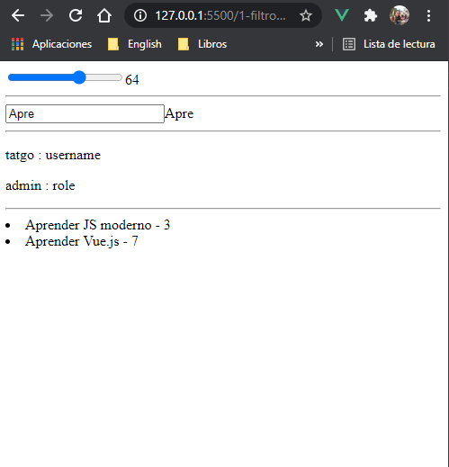

## Aprendiendo Vue - 3

**Eventos y instancia Vue**

Ejercicio consumiendo el API [jsonPlaceholder](http://jsonplaceholder.typicode.com/) por medio del metodo created y mostrando los nombres de los usuarios. 

